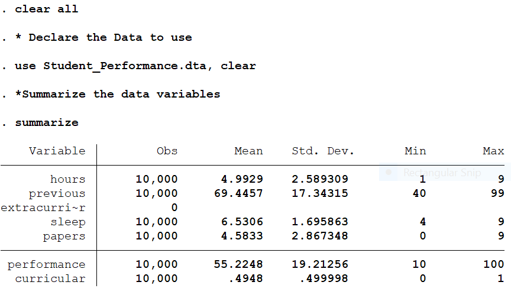
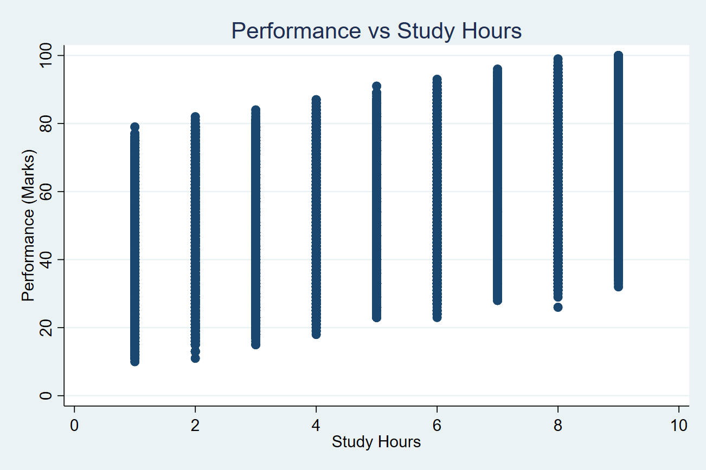
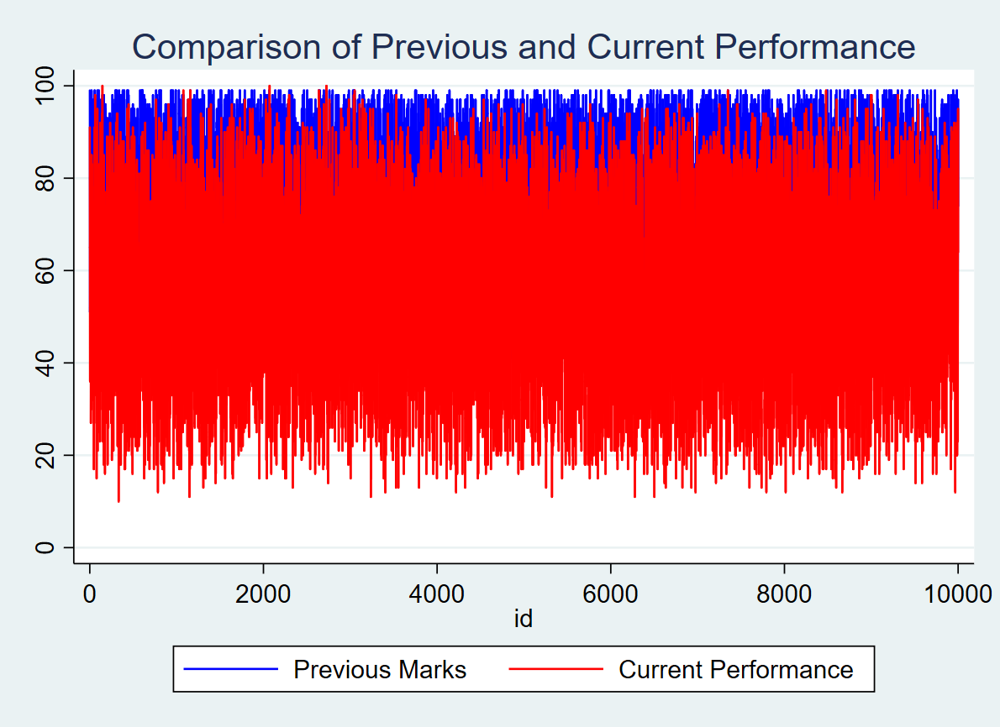
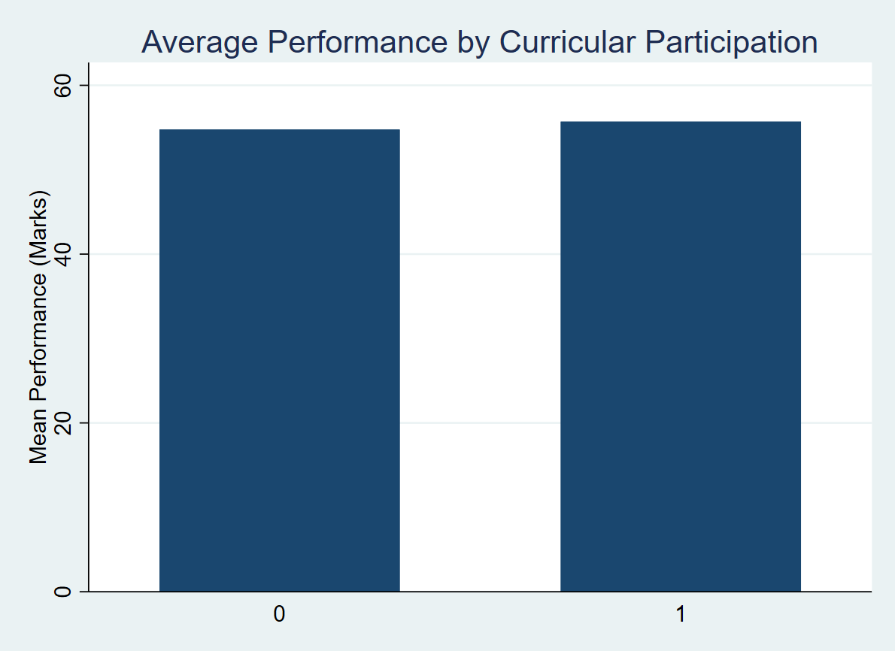
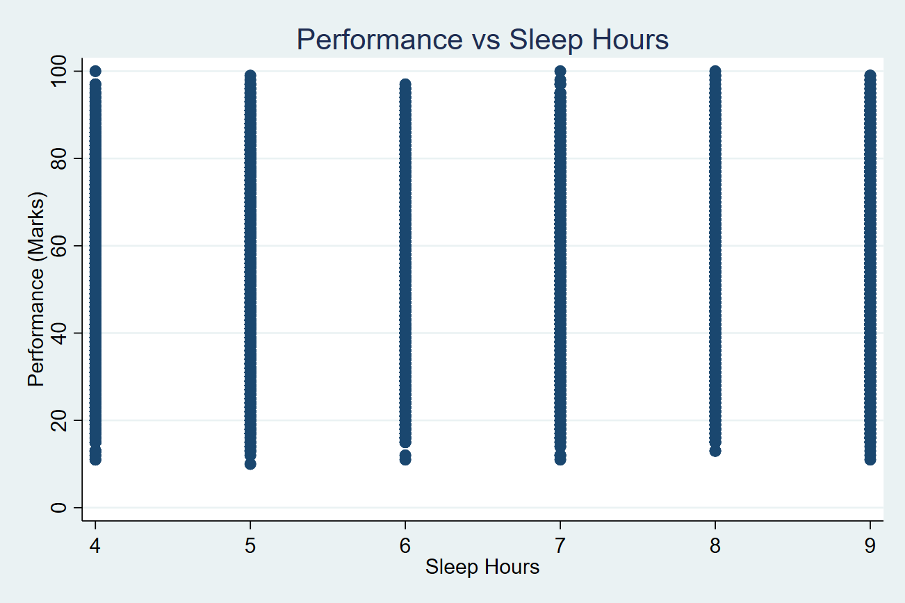
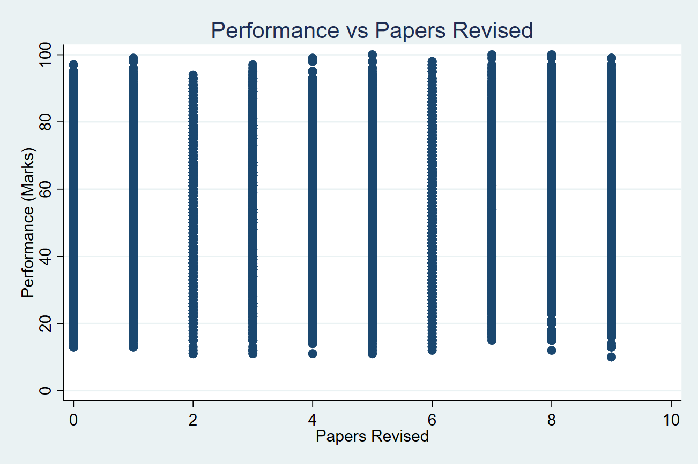

# Multiple Linear Regression in STATA
## By Dan Kipkosgei Kogei, MSc.
Multiple linear regression is a method you can use to understand the relationship between several explanatory variables and a response variable.

If we have p predictor variables, then a multiple linear regression model takes the form:

$Y = \beta_0 + \beta_1X_1 + \beta_2X_2 + … + \beta_pX_p + \epsilon$

where:
- Y: The response variable
- $X_j$: The $j^{th}$ predictor variable
- $\beta_j$: The average effect on Y of a one unit increase in $X_j$, holding all other predictors fixed
- $\epsilon$: The error term

The values for $\beta_0, \beta_1, \beta_2, \ldots, \beta_p$ are chosen using the least squares method, which minimizes the sum of squared residuals (RSS):

$RSS = \sum (y_i - \hat{y}_i)^2$

where:
- $\sum$: A greek symbol that means sum
- $y_i$: The actual response value for the ith observation
- $\hat{y}_i$: The predicted response value based on the multiple linear regression model

The method used to find these coefficient estimates relies on matrix algebra.

## Application Of MLR in Modeling Student Academic Performance in R

This work utilized the secondary data from Kaggle with a sample size of n=10,000. 

The response variable was;
- Performance Index.
  
The Predictor variables were;
- Hours Studied (the number of hours the students takes in studying)
- Previous Scores (Previous performance of the students)
- Extracurricular Activities (If the student is participating in extra curicullar activities)
- Sleep Hours (number of hours student takes in sleeping)
- Sample Question Papers Practiced (number of question papers revised by the student)

## Examining the Data
The output below shows the STATA codes for declaring the data to use and overall summary of the data variables with the respective output.

The dataset contains 10,000 observations for most variables, showing a large and balanced sample suitable for analysis. On average, students spend about 5 hours (hours mean = 4.99) on study-related activities, with values ranging from 1 to 9 hours and moderate variation (SD = 2.59). Prior academic performance (previous) has a relatively high mean of 69.45, indicating generally good past achievement, with scores ranging from 40 to 99. Sleep duration averages 6.53 hours per day, with some variation across students (SD = 1.70). The number of papers completed (papers) is fairly low on average (mean = 4.58), though it varies widely from 0 to 9. Current performance (performance) has a mean of 55.22 with a broad spread (SD = 19.21), suggesting noticeable differences in outcomes among individuals. The binary variable curricular implies that 1 represents "Yes" which means the student participates in extra curricular activities and 0 represents "NO" which means the student do not participate in extra curricular activities. Extracurricular was encoded to curricular because STATA works mainly with numerics.
### Data Visualisation
#### Performance Verses Hours Studied

**Figure 1:** Scatter plot for hours vs performance

Figure 1 shows a clear positive relationship between study hours and performance, indicating that students who spend more time studying tend to achieve higher scores.
#### Current Performance Verses Previous Performance

**Figure 2:** Previous and current performance 

From the figure 2, it is evident that performance was higher in the previous examinations compared to the current performance.
#### Performance by Extra curricular participation

**Figure 3:** Performance by Curricular participation

From Figure 3, it can be observed that the average performance of students who participate in extracurricular activities is almost the same as that of those who do not.
#### Perfornce by Sleep Hours

**Figure 4:** Performance by sleep hours

From Figure 4, it is evident that sleeping hours have little to no observable impact on students’ academic performance. The distribution of performance appears similar across different levels of sleep duration, with no clear upward or downward trend. This suggests that variations in sleep hours do not significantly influence academic outcomes in this dataset.

#### Perfornce by the Number of Past Papers Revised

**Figure 4:** Performance by past papers revised

From Figure 4, it is evident that the past papers revised have some impact on students’ academic performance. The distribution of performance appears to be slightly different across different number of papers, with a little indication that students who revised more past papers tends to perform higher.
